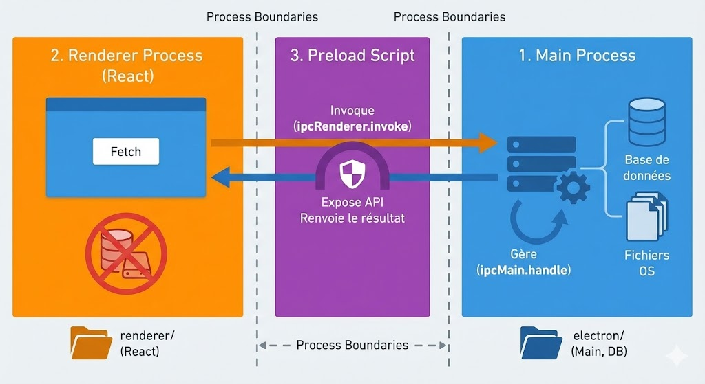

# Cyna Back-Office

Application Back-Office pour la gestion des services, produits, utilisateurs et vitrine commerciale de Cyna.
Cette application est construite avec **Electron**, **React**, **TypeScript** et **SQLite**.

## Démarrage Rapide

### Prérequis
- Node.js
- npm

### Installation
```bash
# Installation des dépendances Electron (racine)
npm install

# Installation des dépendances React (renderer)
cd renderer
npm install
cd ..
```

### Lancement en développement
Pour lancer à la fois le processus Electron et le serveur de développement React :
```bash
npm run dev
```

## Fonctionnalités Principales

- **Dashboard** : Vue d'ensemble des statistiques clés (revenus, produits vendus, etc.).
- **Produits** : Gestion complète (CRUD), vitrine (Showcase), produits phares et carrousel.
- **Services** : Gestion des services unitaires et catégories associées.
- **Utilisateurs** : Gestion des accès administrateurs.
- **Tags** : Système de marquage transversal pour organiser produits et services.

## Structure du Projet

- `electron/` : Backend (Processus principal, API SQLite, Services métier).
- `renderer/` : Frontend (React, Material UI, Vite).
- `docs/` : Documentation technique (Architecture, Modèles, Cas d'usage).




##  Documentation Technique

Pour plus de détails sur la conception de l'application, veuillez consulter le dossier `docs/` :

- [Cas d'utilisation (`docs/use-cases.md`)](./docs/use-cases.md)
- [Modèles de données (`docs/data-models.md`)](./docs/data-models.md)
- [Architecture (`docs/architecture.md`)](./docs/architecture.md)
