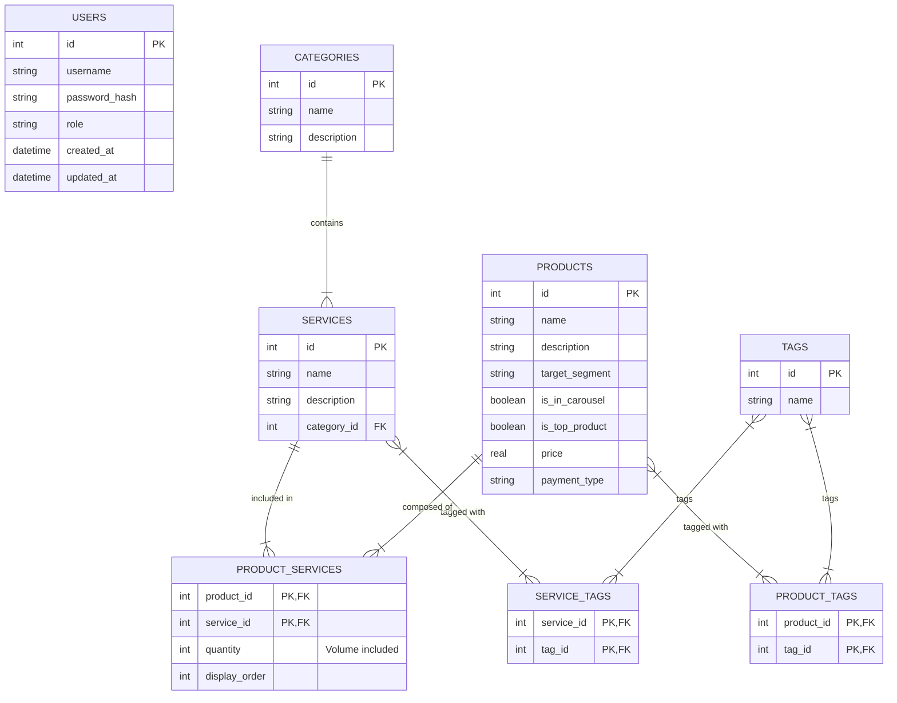

# Modèles de Données

Ce document décrit le schéma de la base de données SQLite locale utilisée par l'application.

## Schéma Relationnel (ER Diagram)

## Description des Entités

### Users
Comptes permettant l'accès au Back-Office.
- **role** : Définit les droits d'accès.

### Services
Briques de base de l'offre Cyna.
- **category_id** : Lien vers la catégorie.

### Categories
Classification des services.

### Products
Offres commerciales packagées.
- **is_in_carousel** / **is_top_product** : Booléens pour la gestion de l'affichage vitrine.
- **price** / **payment_type** : Informations de tarification.

### Product_Services (Table de liaison)
Définit la composition d'un produit.
- **quantity** : Combien d'unités du service sont incluses dans ce produit.

### Tags
Système de marquage flexible pour la recherche et le filtrage.
